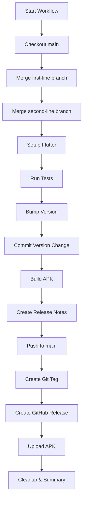

# GitHub Actions Workflow: Release Build and Deploy

This workflow automates the complete release process for the Dancer Ranking App, including branch merging, version bumping, APK building, and GitHub release creation.

## 🚀 What This Workflow Does

1. **Branch Merging**: Automatically merges `first-line` and `second-line` branches into `main`
2. **Version Bumping**: Increments version numbers in `pubspec.yaml` using semantic versioning
3. **Testing**: Runs Flutter tests to ensure code quality
4. **APK Building**: Builds a release APK for Android
5. **GitHub Release**: Creates a GitHub release with the APK and auto-generated changelog
6. **Tagging**: Creates and pushes version tags

## 📋 Prerequisites

Before using this workflow, ensure:

1. **Repository Setup**: Your repository has `main`, `first-line`, and `second-line` branches
2. **Flutter Project**: Valid Flutter project with `pubspec.yaml` in root
3. **Tests**: Flutter tests are working (workflow will run `flutter test`)
4. **Permissions**: GitHub Actions has write permissions to your repository

## 🔧 How to Use

### Manual Trigger (Recommended)

1. Go to your repository on GitHub
2. Click the **Actions** tab
3. Find **Release Build and Deploy** workflow
4. Click **Run workflow** button
5. Select release type:
   - **patch**: Bug fixes (2.2.0 → 2.2.1)
   - **minor**: New features (2.2.0 → 2.3.0)
   - **major**: Breaking changes (2.2.0 → 3.0.0)
6. Click **Run workflow**

### Workflow Process

## 📦 Release Output

Each successful run creates:

1. **Git Tag**: `v2.3.0` (example)
2. **GitHub Release**: With auto-generated changelog
3. **APK File**: `dancer-ranking-app-v2.3.0.apk`
4. **Updated main branch**: With merged changes and version bump

## 🔍 Version Management

The workflow uses semantic versioning:

- **Current format**: `2.2.0+220` (version+build)
- **Version part**: `2.2.0` (major.minor.patch)
- **Build number**: `220` (auto-incremented)

### Version Bump Examples

| Current | Release Type | New Version |
|---------|--------------|-------------|
| 2.2.0+220 | patch | 2.2.1+221 |
| 2.2.0+220 | minor | 2.3.0+221 |
| 2.2.0+220 | major | 3.0.0+221 |

## 📝 Changelog Generation

The workflow automatically generates release notes including:

- **Commit messages** since last release
- **Technical details** (version, build number, Flutter version)
- **Installation instructions**

## 🛠️ Troubleshooting

### Common Issues

1. **Branch Not Found**: If `first-line` or `second-line` branches don't exist, the workflow will skip merging them
2. **Test Failures**: Workflow will fail if `flutter test` fails
3. **Merge Conflicts**: Manual resolution required if branches have conflicts
4. **Permissions**: Ensure GitHub Actions has write permissions

### Debug Steps

1. Check the **Actions** tab for detailed logs
2. Look for specific step failures
3. Check if branches exist and are up-to-date
4. Verify Flutter tests pass locally

## 🔒 Security Considerations

- Uses `GITHUB_TOKEN` for authentication
- No additional secrets required
- Runs on GitHub's hosted runners
- Only triggered manually for security

## 🚀 Advanced Usage

### Customizing the Workflow

You can modify the workflow to:

- Change Flutter version
- Add additional build targets (iOS, web)
- Modify release notes format
- Add notification steps
- Include additional testing steps

### Branch Strategy

This workflow assumes:
- `main`: Production-ready code
- `first-line`: Feature branch 1
- `second-line`: Feature branch 2

Adapt branch names in the workflow if your strategy differs.

## 📊 Monitoring

After each run, check:

1. **GitHub Releases**: New release created
2. **Tags**: New version tag pushed
3. **APK**: Download and test the generated APK
4. **main branch**: Updated with merged changes

## 🤝 Contributing

To improve this workflow:

1. Test changes in a fork first
2. Update this documentation
3. Consider backward compatibility
4. Add error handling for edge cases

---

**Note**: This workflow is specifically designed for the Dancer Ranking App Flutter project. Adapt as needed for other projects.